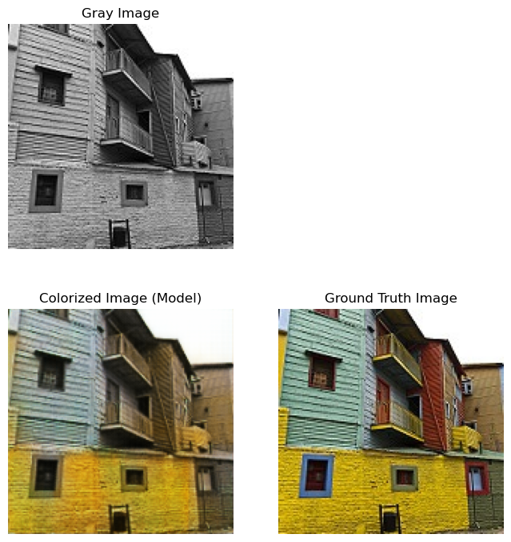

# Colorization: 灰度图像上色的 U-Net 模型

## 项目简介

本项目实现了一个基于 U-Net 结构的深度学习模型，用于将灰度图像转换为彩色图像。通过训练该模型，可以自动为灰度图像添加颜色，实现图像的自动上色功能。该项目在图像处理、计算机视觉等领域具有广泛的应用前景，如老照片修复、黑白电影上色等。

## 效果速览



## 环境要求

- **Python 3.x**
- **PyTorch**
- **torchvision**
- **PIL（Python Imaging Library）**
- **matplotlib**
- **numpy**

### 安装依赖

```bash
pip install torch torchvision pillow matplotlib numpy
```

## 代码详解

### 1. 模型构建

#### 1.1 卷积块（ConvBlock）

```python
class ConvBlock(nn.Module):
    """卷积块：Conv2d -> BatchNorm2d -> ReLU"""
    def __init__(self, in_channels, out_channels, stride=2):
        super(ConvBlock, self).__init__()
        self.conv = nn.Conv2d(
            in_channels, out_channels,
            kernel_size=3, stride=stride,
            padding=1
        )
        self.bn = nn.BatchNorm2d(out_channels)
        self.relu = nn.ReLU(inplace=True)
    def forward(self, x):
        x = self.conv(x)
        x = self.bn(x)
        x = self.relu(x)
        return x
```

- **功能**：实现基本的卷积操作，包括卷积、批归一化和 ReLU 激活函数。
- **输入**：
    - `in_channels`：输入通道数。
    - `out_channels`：输出通道数。
    - `stride`：步长，默认为 2。
- **输出**：经过卷积块处理后的特征图。

#### 1.2 上采样卷积块（UpConvBlock）

```python
class UpConvBlock(nn.Module):
    """上采样块：ConvTranspose2d -> BatchNorm2d -> ReLU"""
    def __init__(self, in_channels, out_channels, stride=2):
        super(UpConvBlock, self).__init__()
        self.upconv = nn.ConvTranspose2d(
            in_channels, out_channels,
            kernel_size=3, stride=stride,
            padding=1, output_padding=1
        )
        self.bn = nn.BatchNorm2d(out_channels)
        self.relu = nn.ReLU(inplace=True)
    def forward(self, x):
        x = self.upconv(x)
        x = self.bn(x)
        x = self.relu(x)
        return x
```

- **功能**：实现上采样操作，用于扩大特征图的尺寸。
- **输入**：
    - `in_channels`：输入通道数。
    - `out_channels`：输出通道数。
    - `stride`：步长，默认为 2。
- **输出**：上采样后的特征图。

#### 1.3 深度可分离卷积（SeparableConv2d）

```python
class SeparableConv2d(nn.Module):
    """深度可分离卷积：Depthwise Conv2d + Pointwise Conv2d"""
    def __init__(self, in_channels, out_channels):
        super(SeparableConv2d, self).__init__()
        self.depthwise = nn.Conv2d(
            in_channels, in_channels,
            kernel_size=3, padding=1,
            groups=in_channels, bias=False
        )
        self.pointwise = nn.Conv2d(
            in_channels, out_channels,
            kernel_size=1, bias=False
        )
    def forward(self, x):
        x = self.depthwise(x)
        x = self.pointwise(x)
        return x
```

- **功能**：实现深度可分离卷积，减少模型参数量，加快计算速度。
- **输入**：
    - `in_channels`：输入通道数。
    - `out_channels`：输出通道数。
- **输出**：经过深度可分离卷积处理后的特征图。

#### 1.4 U-Net 模型（ColorizationUNet）

```python
class ColorizationUNet(nn.Module):
    """用于灰度图像上色的 U-Net 模型"""
    def __init__(self):
        super(ColorizationUNet, self).__init__()
        # 编码器
        self.enc1 = ConvBlock(1, 128)         # 输入为 1 通道灰度图像
        self.enc2 = ConvBlock(128, 128)
        self.enc3 = ConvBlock(128, 256)
        self.enc4 = ConvBlock(256, 512)
        self.enc5 = ConvBlock(512, 512)
        # 解码器
        self.dec1 = UpConvBlock(512, 512)
        self.dec2 = UpConvBlock(512 + 512, 256)  # 跳跃连接，通道数加倍
        self.dec3 = UpConvBlock(256 + 256, 128)
        self.dec4 = UpConvBlock(128 + 128, 128)
        self.dec5 = UpConvBlock(128 + 128, 3)    # 输出 3 通道彩色图像
        # 最后的深度可分离卷积层
        self.final_conv = SeparableConv2d(3 + 1, 3)
        # 激活函数
        self.sigmoid = nn.Sigmoid()
    def forward(self, x):
        # 编码器路径
        enc1 = self.enc1(x)    # (batch_size, 128, 80, 80)
        enc2 = self.enc2(enc1) # (batch_size, 128, 40, 40)
        enc3 = self.enc3(enc2) # (batch_size, 256, 20, 20)
        enc4 = self.enc4(enc3) # (batch_size, 512, 10, 10)
        enc5 = self.enc5(enc4) # (batch_size, 512, 5, 5)
        # 解码器路径
        dec1 = self.dec1(enc5)                      # (batch_size, 512, 10, 10)
        dec1 = torch.cat((dec1, enc4), dim=1)       # 跳跃连接
        dec2 = self.dec2(dec1)                      # (batch_size, 256, 20, 20)
        dec2 = torch.cat((dec2, enc3), dim=1)
        dec3 = self.dec3(dec2)                      # (batch_size, 128, 40, 40)
        dec3 = torch.cat((dec3, enc2), dim=1)
        dec4 = self.dec4(dec3)                      # (batch_size, 128, 80, 80)
        dec4 = torch.cat((dec4, enc1), dim=1)
        dec5 = self.dec5(dec4)                      # (batch_size, 3, 160, 160)
        # 拼接输入和解码器输出
        dec5 = torch.cat((dec5, x), dim=1)          # (batch_size, 4, 160, 160)
        # 最后的卷积层
        out = self.final_conv(dec5)                 # (batch_size, 3, 160, 160)
        out = self.sigmoid(out)                     # 将输出限制在 [0, 1]
        return out
```

- **功能**：构建完整的 U-Net 模型，用于灰度图像上色。
- **编码器**：逐步降低特征图尺寸，提取高层次特征。
- **解码器**：逐步恢复特征图尺寸，并使用跳跃连接融合编码器的信息。
- **输出**：生成的彩色图像，尺寸与输入灰度图像相同。

### 2. 数据集加载

#### 2.1 自定义数据集类（ColorizationDataset）

```python
class ColorizationDataset(Dataset):
    """用于灰度图像上色的自定义数据集"""
    def __init__(self, color_dir, gray_dir, transform=None):
        self.color_dir = color_dir
        self.gray_dir = gray_dir
        self.transform = transform
        # 获取彩色和灰度图像的文件列表
        self.color_images = sorted(os.listdir(color_dir))
        self.gray_images = sorted(os.listdir(gray_dir))
        # 确保彩色和灰度图像数量相同
        assert len(self.color_images) == len(self.gray_images), "彩色和灰度图像数量不匹配"
    def __len__(self):
        return len(self.color_images)
    def __getitem__(self, idx):
        # 获取图像路径
        color_img_path = os.path.join(self.color_dir, self.color_images[idx])
        gray_img_path = os.path.join(self.gray_dir, self.gray_images[idx])
        # 读取图像
        color_image = Image.open(color_img_path).convert("RGB")
        gray_image = Image.open(gray_img_path).convert("L")
        # 应用变换
        if self.transform:
            color_image = self.transform(color_image)
            gray_image = self.transform(gray_image)
        return gray_image, color_image
```

- **功能**：加载灰度图像和对应的彩色图像，供模型训练使用。
- **输入**：
    - `color_dir`：彩色图像的目录路径。
    - `gray_dir`：灰度图像的目录路径。
    - `transform`：图像预处理变换。
- **输出**：预处理后的灰度图像和彩色图像张量。

### 3. 数据预处理与加载

```python
# 图像尺寸
IMAGE_SIZE = 160

# 定义变换
transform = transforms.Compose([
    transforms.Resize((IMAGE_SIZE, IMAGE_SIZE)),
    transforms.ToTensor(),  # 转为张量，归一化到 [0, 1]
])

# 数据集路径
color_dir = 'path_to_color_images'
gray_dir = 'path_to_gray_images'

# 创建数据集和数据加载器
dataset = ColorizationDataset(color_dir, gray_dir, transform=transform)
batch_size = 16
dataloader = DataLoader(dataset, batch_size=batch_size, shuffle=True)
```

- **功能**：定义图像预处理方式，创建数据集和数据加载器。
- **变换**：调整图像尺寸，转换为张量。
- **数据加载器**：批量加载数据，支持随机打乱。

### 4. 模型训练

#### 4.1 定义模型、损失函数和优化器

```python
# 实例化模型并移动到设备
model = ColorizationUNet().to(device)

# 定义损失函数
criterion = nn.MSELoss()

# 定义优化器
optimizer = torch.optim.Adam(model.parameters(), lr=1e-4)
```

- **损失函数**：使用均方误差损失（MSELoss）衡量生成图像与真实彩色图像的差异。
- **优化器**：使用 Adam 优化器进行参数更新。

#### 4.2 训练循环

```python
num_epochs = 50  # 训练轮数

for epoch in range(num_epochs):
    model.train()
    running_loss = 0.0
    for gray_images, color_images in dataloader:
        # 将数据移动到设备
        gray_images = gray_images.to(device)
        color_images = color_images.to(device)

        # 前向传播
        outputs = model(gray_images)

        # 计算损失
        loss = criterion(outputs, color_images)

        # 反向传播和优化
        optimizer.zero_grad()
        loss.backward()
        optimizer.step()

        # 累加损失
        running_loss += loss.item()

    # 计算平均损失
    epoch_loss = running_loss / len(dataloader)
    print(f"Epoch [{epoch+1}/{num_epochs}], Loss: {epoch_loss:.4f}")

    # 保存模型和可视化结果
    if (epoch + 1) % 1 == 0:
        # 保存模型
        torch.save(model.state_dict(), f'./checkpoints/colorization_epoch_{epoch+1}.pth')

        # 可视化结果
        model.eval()
        with torch.no_grad():
            sample_gray, _ = next(iter(dataloader))
            sample_gray = sample_gray.to(device)
            output_color = model(sample_gray)
            # 转为 CPU 并转换为 numpy 数组
            sample_gray = sample_gray.cpu().numpy()
            output_color = output_color.cpu().numpy()

            # 保存结果到 'record' 文件夹
            for i in range(4):
                # 保存灰度图像
                gray_image = sample_gray[i, 0]
                plt.imsave(f'record/epoch_{epoch+1}_sample_{i+1}_gray.png', gray_image, cmap='gray')

                # 保存生成的彩色图像
                output_img = np.transpose(output_color[i], (1, 2, 0))
                plt.imsave(f'record/epoch_{epoch+1}_sample_{i+1}_color.png', output_img)
```

- **训练步骤**：
    - 模型设为训练模式。
    - 遍历数据加载器，获取灰度图像和彩色图像。
    - 前向传播，计算模型输出。
    - 计算损失并反向传播。
    - 更新模型参数。
- **模型保存和结果可视化**：
    - 每个 epoch 结束后，保存模型参数。
    - 选取部分样本进行推理，并保存灰度图像和生成的彩色图像。

## 运行示例

### 1. 准备数据集

- **彩色图像目录**：将彩色图像放在指定的文件夹中，例如 `path_to_color_images`。
- **灰度图像目录**：将对应的灰度图像放在指定的文件夹中，例如 `path_to_gray_images`。
- 确保彩色图像和灰度图像的文件名一一对应，数量相同。

### 2. 运行训练代码

- 在配置好环境和数据集后，运行训练脚本。
- 训练过程会输出每个 epoch 的损失值，并在指定的文件夹中保存模型和可视化结果。

### 3. 查看结果

- 在训练过程中，生成的彩色图像和对应的灰度图像会保存在 `record` 文件夹中。
- 可以使用图像查看器打开这些图片，观察上色效果。

## 输出结果说明

- **损失值（Loss）**：每个 epoch 输出一次，表示模型在当前轮次的平均损失。损失值越低，说明模型性能越好。

  ```
  Epoch [1/50], Loss: 0.0648
  Epoch [2/50], Loss: 0.0487
  ...
  Epoch [50/50], Loss: 0.0018
  ```

- **生成的图像**：
    - **灰度图像**：命名为 `epoch_{epoch_number}_sample_{sample_number}_gray.png`。
    - **生成的彩色图像**：命名为 `epoch_{epoch_number}_sample_{sample_number}_color.png`。
    - 通过对比灰度图像和生成的彩色图像，可以直观地评估模型的上色效果。

## 注意事项

- **数据集质量**：数据集的质量和多样性会直接影响模型的上色效果，建议使用高质量、丰富多样的图像进行训练。
- **训练时长**：根据硬件性能和数据集大小，训练时间可能较长，可以调整 `num_epochs` 或使用更高效的硬件加速训练。
- **结果评估**：可以根据实际需求，调整模型结构和超参数，以获得更好的上色效果。